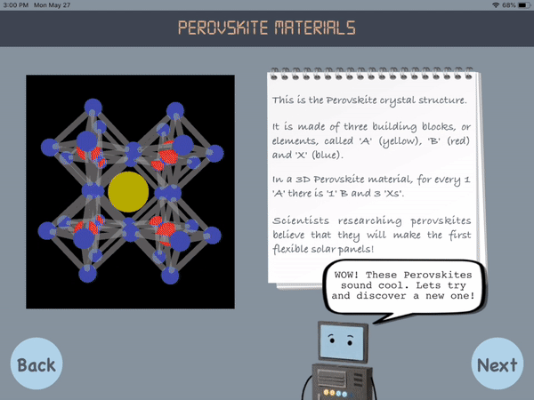

# iOS SMACT

Interactive educational / outreach app for generating new perovskite structures from element combinations inspired by [SMACT](https://github.com/WMD-group/SMACT).

It was used as part of the 2018 Royal Society Summer Exhibition [Code for Creation](https://royalsociety.org/science-events-and-lectures/2018/summer-science-exhibition/exhibits/code-for-creation/).

# Developer Acknowledgements
- [Ed Attard Montalto](https://www.linkedin.com/in/edward-attard-montalto-875555135/)
- [Sophie O'Donnell](https://github.com/SophieOD)
- [Jacob Wilson](https://github.com/Jnwilson95)
- [Daniel Davies](https://github.com/dandavies99)
- [Lucy Whalley](https://github.com/lucydot)
- [Suzy Wallace](https://github.com/skw32)
- [Aron Walsh](https://github.com/aronwalsh)

# App preview

The app shows an introductory video, introducing the background of the materials design challenge:

Elements of the periodic table can be chosen by the user to create a (potentially new!) perovskite crystal structure, with the help of "Thomas" the supercomputer:

